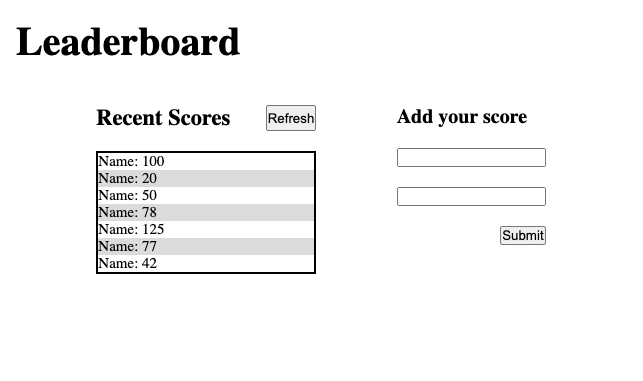

# Leaderboard

> This is about consuming an API.

<div align="center"></div>

Mobile ScreenShots

## Link of Web Page

- GitHub Pages: [@eri8-9](https://eri8-9.github.io/leaderboard/dist/)

## Built With

- HTML, CSS & JS

## Getting Started

### Prerequisites
  - Read about [webpack](https://webpack.js.org/guides/getting-started/) before start.
  - Just follow the steps for Getting started, Asset Managment(optional), Output Management and Development (Install the webpack-dev-server)

### Setup
  - Better have [VS Code](https://code.visualstudio.com/) installed or install the source-code editor of your preference. 

### Install
  - In the terminal go to the folder you going to work and write the next. 
  ```
  git clone https://github.com/eri8-9/leaderboard.git
  ```
  - Next go to VS Code editor and open the folder where you installed the repository.
### Usage
  - Don't forget to create a branch to star working on the project.
  - Now that you have everything set up you are ready to work.

## Authors

👤 **Christian Erick Contreras**

- GitHub: [@eri8-9](https://github.com/eri8-9)
- Linkedin: [LinkedIn](https:linkedin.com/in/christian-erick-contreras-9945b820b)
- Twitter: [@ChristianErick_](https://twitter.com/ChristianErick_)

## Show your support

Give a ⭐️ if you like this project!

## Acknowledgments

- Microverse

## 📝 License

This project is [MIT](LICENSE) licensed.